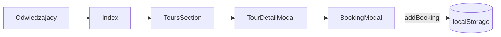

# ARCHITECTURE — mapa dla obcego (1 strona)

<!-- Cel: senior, ktory nigdy nie widzial repo, znajduje miejsce zmiany w 15 min. -->

## Co to jest (3 zdania)
Demo site "Norðan Travel" — **fikcyjny** operator małogrupowych wycieczek po Islandii (max 8 osób,
lokalni przewodnicy), zbudowany jako pokazowy przykład dla klientów agencji
[Reykjawwwik](https://reykjawwwik.is). Pozycjonowanie: przeciwieństwo autokarowych wycieczek
masowych. Zero prawdziwych klientów/rezerwacji/płatności i **zero logowania** — to wyłącznie
front, a zapytanie z formularza ląduje w `localStorage` przeglądarki odwiedzającego.

## Stack (z package.json / README)
- Frontend: React + TypeScript, Vite, react-router-dom (3 trasy), TanStack Query (bez realnych zapytań)
- UI: Tailwind CSS + shadcn/ui (Radix), lucide-react
- "Backend": **brak realnego** — `src/lib/store.ts` symuluje rezerwacje i zablokowane daty w
  przeglądarkowym `localStorage` (dane tylko lokalnie, znikają po wyczyszczeniu przeglądarki)
- Testy: Playwright E2E + Vitest (`src/test/`)
- Hosting: **Lovable** (`lovable-tagger` w `vite.config.ts`) — `git push` na `main` NIE deployuje,
  produkcję aktualizuje ręczny **Publish** w Lovable UI

## Moduły i granice (co jest gdzie)
| Katalog / plik | Odpowiedzialność | Tier |
|---|---|---|
| `src/pages/Index.tsx` | strona główna one-page (Hero, ToursSection, OurStory, Testimonials, FAQ, Contact) | T1 |
| `src/lib/store.ts` | **cały "backend"** — zapis zapytania do `localStorage` (`addBooking`) i odczyt zablokowanych terminów (`isDateBlocked`). Bez logowania, bez sekretów, bez panelu | T1 |
| `src/components/ToursSection.tsx` / `TourDetailModal.tsx` | katalog wycieczek (Golden Circle, jaskinie lodowe, zorza) | T1 |
| `src/components/BookingModal.tsx` | formularz rezerwacji — zapisuje przez `addBooking()` do `localStorage` | T1 |
| `src/components/DemoNotice.tsx` | baner informujący, że to demo | T1 |
| `src/i18n/*` | słownik i kontekst języka | T1 |

## Przepływ użytkownika

## Gdzie jest…
- katalog wycieczek i ceny: `src/i18n/translations.ts` (`tours.items`)
- "rezerwacje": `src/lib/store.ts` (localStorage, klucz `nordan_bookings`)
- logowanie: **nie ma go w ogóle** — repo nie zawiera żadnej bramki auth ani danych logowania. Panel `/admin` z udawanym logowaniem został usunięty; `src/test/store.test.ts` pilnuje, żeby nie wrócił
- sekrety: brak realnych — patrz zastrzeżenie wyżej

## Decyzje nieodwracalne
`docs/adr/` — zobacz istniejące ADR w repo.

## Jak to cofnąć / kill switch
Strona statyczna bez realnego backendu — rollback = Lovable "Revert to this version" albo `git revert` + Publish.
Reset danych demo: wyczyść `localStorage` przeglądarki (klucze `nordan_bookings`, `nordan_blocked`).
